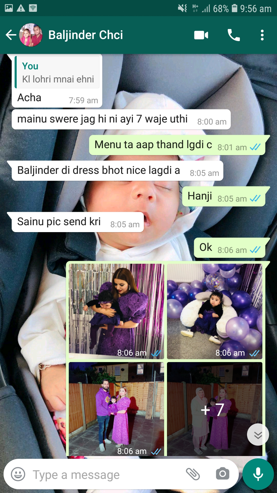
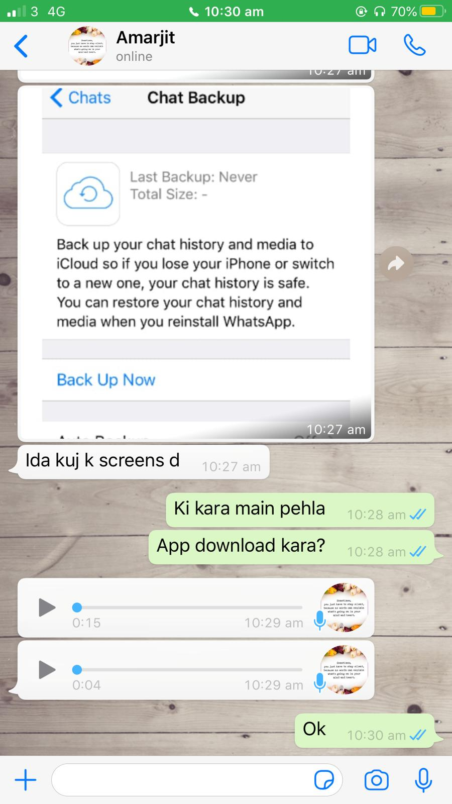
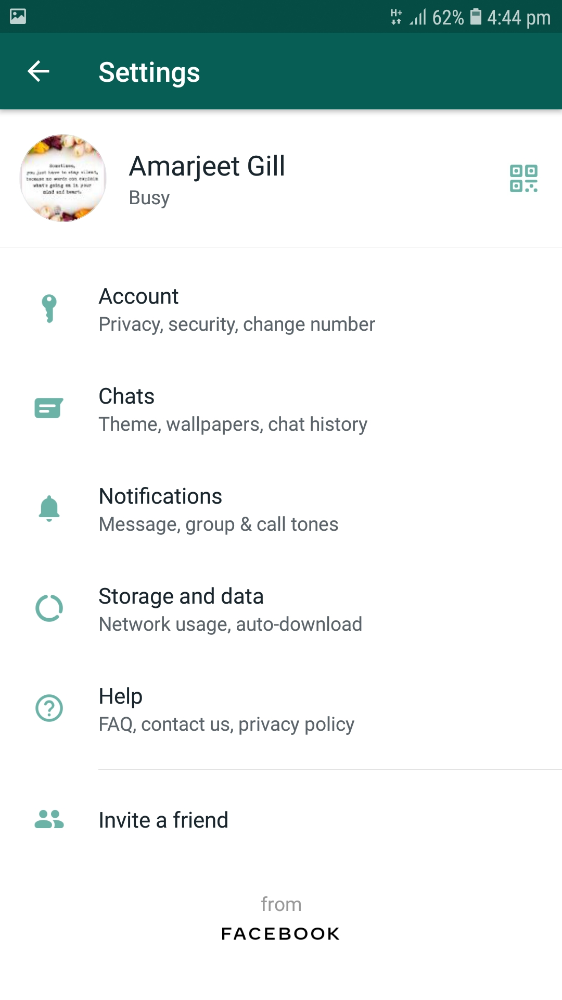
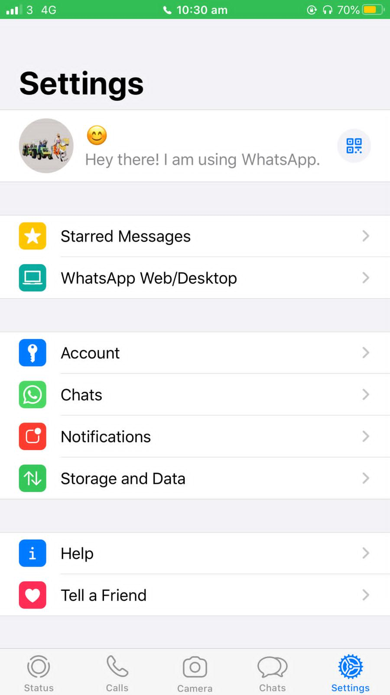

# Process-portfolio-amar
## Week 1 Activities
### *Activity Number* = 0101
Here i would like to share my recent programming project in which i used java script as a programming language in DGL 113,i did everything perfactly but at the execution time i did not get desired result of my web page , i cross checked everything but i could not find any error in programming.i was very disappointed because i spent too much time on that but still cannot solved my issues.

## Code of the problem :

`var roomRate = prompt("What's your room's daily rate");`

 `var GST=0.05 * roomRate;`
 
 `var PST=0.08 * roomRate;`
 
 `let myelement = document.getElementById("mydata");`
 
 `myelement.innerHTML="Your room rate is $" + roomRate + "; GST is : $" + GST +" ; PST is $" + PST;`

### Here actually i forget to add (.)operator before getElementById("mydata") that's why my page enable to fetch data from rooms page.

## How to solve it 
After reading "pragmatic philosophy" i open my code and study it again with fresh mind, i checked everythinhg and after sometime i find out the exact problem and solve it,it restore my confidence and am happy now because it is my assignment and finally i did it correctly as per requrements and research stratergy worked here.
### *Activity Number* = 0102

Here am going to open my java program from CPS 100 in the last semester,in which program reads values representing a time duration in hours, minutes, and seconds and then prints the total number of seconds.

## code of the program:

/*
Write a program that reads values representing a time
duration in hours, minutes, and seconds and then prints the 
equivalent total number of seconds. (For example, 1 hour, 28
minutes, and 42 seconds is equivalent to 5322 seconds.)
*/
```java

  import java.util.*;

   class p2_8{

           public static void main(String args[]){
		
		int hours, mint;
                int sec, calculatedSec;
		Scanner in = new Scanner(System.in);
		
		System.out.print("Enter Hour(s) : ");  
        hours = in.nextInt();  
		
		System.out.print("Enter Mint(s) : ");  
        minutes = in.nextInt();  
		
		System.out.print("Enter Sec(s) : ");  
        seconds = in.nextInt();  
		
		
		calculatedSec = seconds + (60 * mint) + (3600 * hours);
		
		System.out.println("Total Sec are : " + calculatedSec);

	}
	}

	
```

## Areas of improvement for readability:


### 1. White space

I think i used unnecessary white space during declaration of intergers in the starting of the program

int hours, mint;
                int sec, calculatedSecon;
  
"This declaration should be like this" = int hours, mint, sec, calculatedSec;

### 2. Lack of comments:
I also observ that program should need more comments instead of only explaining its purpose on the top, like we should add some simple comments before doing anything like in the starting we should add comment before declaring the variables then on the calculation place we also add comments like calculating seconds so that every user can understand it clearly without any confusion.


### 3. Naming variables:
I think i should use more approprioate and descriptive names of variables instead of using its abbreviations like hours,mint,sec,calculatedsec.


## After improvement 

/*
Write a program that reads values representing a time
duration in hours, minutes, and seconds and then prints the 
equivalent total number of seconds. (For example, 1 hour, 28
minutes, and 42 seconds is equivalent to 5322 seconds.)
*/
```java
import java.util.*; 

class p2_8{

	public static void main(String args[]){
	
	//declaring variables
	
		int hours, minutes,int seconds, calculatedSeconds;
		Scanner in = new Scanner(System.in);
		
		System.out.print("Enter Hour(s) : ");  
                hours = in.nextInt();  
		
		System.out.print("Enter Minute(s) : ");  
                minutes = in.nextInt();  
		
		System.out.print("Enter Second(s) : ");  
                seconds = in.nextInt();  
		
	//calculating seconds
	
		calculatedSeconds = seconds + (60 * minutes) + (3600 * hours);
	//displaying total seconds
	
	       System.out.println("Total Seconds are : " + calculatedSeconds);

	}
	}
	/*
	

Result:

Enter Hour(s) : 1

Enter Minute(s) : 1

Enter Second(s) : 60

Total Seconds are 3720
*/
```

# Week 2 Activities
## *Activity Number* = 0201
### Factors that helps in identify the target user base
1. **Purpose of your app**
2. **Who would want to use your app and why,think about that?**
3. **Simplicity of your mobile app**
4. **Consider the goals and expectations of group of users**
5. **Do more research and try to understand users wants and their needs from your app**

### Target user base
>The term "target user base" is a huge term it means alot for the developer,because target users are the real users that would use developers product(app) .in other words,target customers can be found in different categories such as **children,adult,men,women,old,teenagers** and so on.Thus,they are specific group of people who will respond your product and their response will be based on various factors such as money,their geographcal location,knowledge,age,gender and many more factors.
### Mobile app that i use regularly
Here i would like to talk about **Instagram app** that i used on regular bases,actually instagram is a social app that have millions users,i used that app to keep in touch with my friends and family members. It is one of the best app that basically used by every person from normal to celebrity.This app is very easy to operate and it also provide the calling option for their users,so people can easily interact with each other.
Secondly,it also gives a plateform to people for making their career as many people run their pages and show their talent to others and generate good income,it is also good for promotion and selling goods.
>i must say **instagram** is a good app and it fulfill my goals and that exactly match with the target user base .As it is for everyone and does not matter from where people can access it.
## *Activity Number* = 0202
Consider a recent programming project (it can be one of those you identified last week). Examine the identifiers (i.e. variable and method names, etc.) used in the code. Are they sufficiently descriptive? Are they perhaps too descriptive (i.e. too long, or to complicated). Do they make sense in the context of your project? Identify between five and ten names in the code that you could consider changing either to be more descriptive, or more consistent with one another. Briefly explain your rationale.
### Consider the following piece of code

```java

public class EmpController {

	private EmpModel model;
	private EmpView view;
	
	public EmpController(EmpModel model, EmpView view){
		this.model = model;
		this.view = view;
	}
	public int getEmpNo() {
		return model.getEmpNo();
	}
	public void setEmpNo(int EmpNo) {
		model.setEmpNo(EmpNo);
	}
	public String getEmpName() {
		return model.getEmpName();
	}
	public void setEmpName(String EmpName) {
		model.setEmpName(EmpName);
	}
	public String getEmpDepartment() {
		return model.getEmpDepartment();
	}
	public void setEmpDepartment(String EmpDepartment) {
		model.setEmpDepartment(EmpDepartment);
	}
	// this method is used to retrieve data
	public void UpdateView() {
		view.printEmpDetail(model.getEmpNo(), model.getEmpName(), model.getEmpDepartment());
	}
		}
```


### List of used variables in the code
1. EmpNo
2. EmpName
3. EmpDepartment
4. Empcontroller
5. EmpModel
6. EmpView
### Examine the identifiers
>I think my identifiers names in this program are sufficiently descriptive because all the variable and method names can easily clarify their purpose in the program.for example we all are aware about that most of us used **emp** name for **employees** so its very common variable name and easy to guess for what the given information is about.and all the identifiers makes sense in the program.
### changing names to be more descriptive
1. I choose **EmpNo** for changing their name,if i choose their nameas **EmpNumber** instead of EmpNo it should be more descriptive.
2. Then i select **EmpDepartment**,it should be more identical if its name will be **EmpDep** because EmpDepartment is too long name.
3. **EmpController** is also complicated name so i chnaged it as **EmpCtrler.**
4. **EmpView** should be an **EmployeeView** as it looks more descriptive
5. We can also change **emp** as **employee** if we want to make it more descriptive but it is too long.


# Week 3 Activities
## *Activity Number* = 0301

## App for comparison(Whatsapp)

### Whatsapp is an social networking app which is widely used for communication purpose. In the followind image you can see the different platforms of whasapp app,in the left side you can see the android version of whatapp and in the right side there is an ios version of whatsapp.

### 1. Different controls position and its appearance
>  From the image i can observe the major difference is its appearance and controls ,as in the android  there are basically three main button(icons) on the top right side of the screen they are about video call,audio call and one link for another information like contact information

>But in the ios there are only two major links one for video call and another is for audio call

> For the backward control android have back button in the form of arrow in the left side of the screen and ios have small icon on the same place.On iphone more options are placed at the bottom of the app.


<table>
<tr><th>
 </img><th>
  </img>	
 </th></tr></table>	


 
### 2. Setting screen
> When we observed the setting screen of both platforms then we can easily said that ios(iphone) have more setting obtions than android.


<table>
<tr><th>
 </img><th>
  </img>	
 </th></tr></table>	


> Thus both platform have their own features and drawbacks,android have its back control(button) which is best and ios have their own functions .

> Personally i used android mobile and it is easy to operate i also tried iphone but i did not like it because i feel it is more complicated than android and android have more features and user friendly.


## *Activity number* = 0302

### "Android Developer Guides"
>I visited this guide and learn alot about documentation and why it is so important for us
### Application Fundamentals
>I explore the application fundamental section  of android developer guide,it is one of the most important article which explain about the fundamentals of android apps.
### Structure of the documentation
>The structure is the basic thing of every document which describe the organization of document. In the application fundamental page all the content are properly structured that helps user during reading.

1. For example the **definition** of application fundamental is on the top of the page which explained about its coding **languages** and other developmemt tools.
2. Then **bullets points** are used for adding its security features ,these small bullets gives different look to its features.
3. **Bold heading** is also used in this documentation for the components such as **activities**,**services**,**broadcast receiver**,**content provider**
4. Proper **paragraph** tags are also used for align the text of the document which is very essential part of good documentation

5. **Dark background** is also used for coding purpose which gives unique look to the code
6. Blue hypertext **links** are used for linking the document 


**Summary**

>An android app can written in java,kotlin and c++,and it is a multiuser system and every process his own virtual machine which makes them independent from other apps.the main app components are : Activities,Services,Broadcast receiver and content provider

> There is proper heading ,sub-headings are used in this document.For the formatting there is bold text ,hyperlinks,paragraph,
bullet points are used

>I leraned about how the text formatting is important,all the main heading should be bold so that it will be more highlightes and we should use small bullets point and ordered list for highlighting some points like types and features of anything.
Paragraph should also be proper aligned and main headings and sub-headings should be written in seprate line so that they can easily identify .


# Week 4 Activities
## *Activity Number* = 0401
### Pattern of interest
> I select an pattern of **bond of personal security** where they ask for **email and emergency contact**,i found this pattern is more useful because they can easily reached out to us and we can get to knew each and every notification through email that would be the best way to communicate with each other.

### When and how it is useful

> The pattern of personal security ,where we have to add emergency contact and email address is very useful in different situations .suppose in any app if we add this pattern this would be very benificial to users during emergency , secondly email is perfact way to get intouch with anybody because it is easy to opearte and it is cost effective.thus our app must use these advance intelligence pattern to smooth fuctionality of the app.


## *Activity Number* = 0402

### Exercise 1

> You’re asked to read a file a line at a time. For each line, you have to split itinto fields. Which of the following sets of pseudo class definitions is likely to be more orthogonal?

class Split1 {
	
constructor(fileName)  # opens the file for reading

def readNextLine()       # moves to the next line  
def getField(n)          # returns nth field in current line

}

or

class Split2 {

constructor(line)        # splits a line  
def getField(n)         # returns nth field in current line

 }


 ### Evaluation 

 > According to me class split2 is more orthogonal because it only gives priority to their main task spliting line and ignore the other details such as file name of the constructor and moving to next line. It simply split a line then return the nth field of the current line.

 ## How the concept of orthogonality relates to MVC

 The concept of orthogonality is also relate with MVC(model,view,controller) because the design of the orthogonality is based on layers and each layer follow abstraction approach.All layers works independently so user interface works as view and application framework and database access all layered works as model ,containers and standard services are similar to controller elements of data.


# Week 5 Activities
## *Activity Number* = 0501
### MVC, MVP, MVVM

> These all three are popular android architecture that have their own features and disadvantages,i will explain its main similarities and distinctions in subsequent paragraphs: 

## Main similarities between MVC, MVP, MVVM

* The MVC,MVP,MVVM are most widely used design pattern. MVC stand for *Model View Controller* and MVP stand for *Model View Presenter*,and MVVM stand for *Model-View-ViewModel*.So, Model is a common layer in all these android architecture,which works in similar way in all three models. it contain business logic and data state that communicate with controller and change the data,it also interact with database.
* View is also available in all three approaches for user interface but it interact with differently in different architecture.

## Main difference between MVC, MVP, MVVM
* In these architectures the user input begins at different place,for example,in MVC the input begins at controller whereas in MVP input begins with view and in MVVM it starts from model.
* MVC is the traditional  and simple approach of android architecture while MVP and MVVM are the latest android architectures.
* In MVC there is many-to-one relation between controller and view.and one-to-one relation between view and presenter and one-to-many in MVVM.
* The code is more maintainable and readable in MVP and we can reuse the view and presenter at different places as compare to MVC.
## How to choose one over other

> MVC is only viable option if we design simple application having just limited numbers of screens(1,2) while MVP and MVVM
are good option in breaking down into module,in which we can reuse the existing code.if we need reuse the code and tightly coupled code then we should go with MVP and if we do not need tight coupling between view and model then MVVM is good option. 


## *Activity Number* = 0502

## Global variables
A global variable have global score which means we can access it from anywhere.here am going to share my java script code in which i used some global variables. in java script global variables declare outside the function.

## java script code <br>
>var roomRate = prompt("What's your room's daily rate");<br>
var GST=0.05 * roomRate;<br>
var PST=0.08 * roomRate;<br>
let myelement = document.getElementById("mydata");<br>
myelement.innerHTML="Your room rate is $" + roomRate + "; GST is : $" + GST +" ; PST is $" + PST;


Here GST,PST all are global variables and we can uncoupled these variable by using function in which we put all the variable under function then we can enter the room rate through prompt,in that way we can change global variable into local scope within the function.


